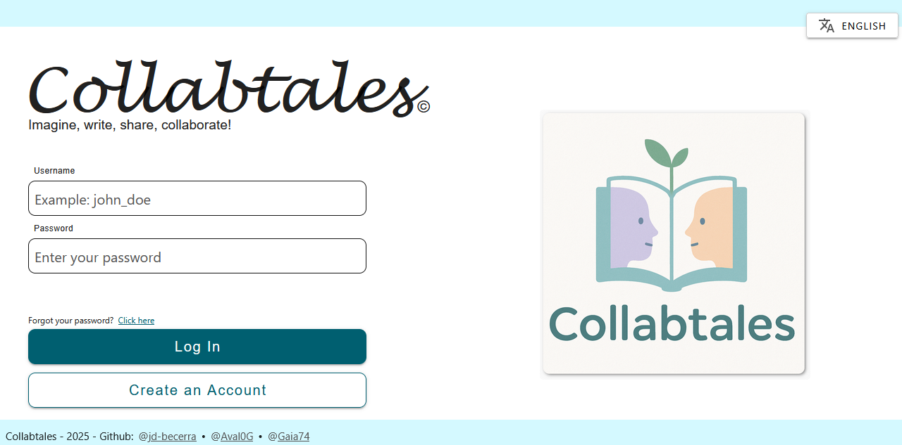

# Collabtales: https://collabtales.avaldez0.com/

Collabtales is a web platform designed for everyone to collaboratively create and develop stories. Each user can start a story and generate a unique code to invite other participants to continue the narrative. The goal is to foster creativity, teamwork, writing, and reading.

> **⚠️ IMPORTANT: This project is only a prototype and is not intended for heavy use. It is a personal project developed for learning and practicing web development skills.  
> We are not responsible for any issues that may arise from using this application, such as data loss or security breaches.  
> **Use it at your own risk.**

## Contents

- [Collabtales: https://collabtales.avaldez0.com/](#collabtales-httpscollabtalesavaldez0com)
  - [Contents](#contents)
  - [Technology Stack](#technology-stack)
  - [Features](#features)
  - [How to Start?](#how-to-start)
## Technology Stack

- **Vue 3** as the frontend framework, providing a reactive and component-based architecture. Some techniques used were: 
  - **Composition API** for better organization of logic and reusability of components.
  - **Vue Router** for managing navigation between different views in the application.
  - **VueUse** for utility functions that enhance the functionality of Vue applications.
  - **VueEmit** for event handling, allowing components to communicate effectively.
- **Vuetify and CSS** for styling, ensuring a modern and responsive design. CSS was used to allow for global styles and Vuetify for a rich UI component library.
- **Vite** as the bundling tool, enabling fast startup and instant reloads during development.
- **TypeScript** (support via `vue-tsc`) to improve code quality and developer experience. Some packages used were:
  - **I18n** for internationalization, allowing the application to support English and Spanish languages, enhancing accessibility for a wider audience.
  - **Axios** for making HTTP requests to the backend API, facilitating communication between the frontend and backend.
  - **TipTap** as the rich text editor, enabling users to write and format their contributions easily. It supports: bold, italic, underline, align text, change text color and redo/undo actions.
  - **html2pdf** for generating PDF files from the tales, enabling users to download stories in a portable format.
- **PHP** for the backend, providing a RESTful API that handles server logic and data persistence. In addition, we used PHP packages to enhance functionality such as:
  - **Firebase JWT** for secure user authentication, allowing users to log in and manage their sessions.
  - **PHP Mailer** for sending emails, enabling password recovery for users.
- **MySQL** as the database to store stories, users, and their interactions.

## Features
- **User Registration and Login**: Users can create accounts and log in to access their stories using: a username, email, and password (which is hashed for security and can be retrieved via the user's email).
- **Tale Creation**: Users can create new stories (called "tales"), which are stored in the database and associated with their accounts. The creator can: 
  - See the unique code given to the tale, which can be shared with other users in order to invite them to collaborate.
  - Edit the tale's title and description.
  - Manage collaborators and allowing/restricting the option to join the tale.
  - Delete their own tale (removing every contribution made by other users).
  - Publish the tale, making it visible to all users in the application, so they can read it and vote for it.
- **Collaborative Writing**: Users can join existing tales using the unique code provided by the tale creator. They can:
  - Read the tale's content.
  - Add their own contributions to the tale, which are stored in the database and associated with their user account.
  - Edit their own contributions, allowing for corrections and improvements.
  - Abandon the tale, which removes their contributions from the tale but does not delete the tale itself.
- **Tale Voting**: Users can check published tales and vote for the ones they like. In addition, they are able to download the tale in a PDF format.
- **Account Management**: Users can manage their accounts and change their data if needed. They can also recover their password via email if they forget it.
- **Internationalization**: The application supports both English and Spanish languages, allowing users to switch between them for a better user experience.

## How to Start?
1. First, visit the [Collabtales website](https://collabtales.avaldez0.com/) to see the application in action. You can choose between English and Spanish languages using the language selector in the top right corner.
2. Make an account or log in if you already have one. You will need a username, email, and password to register (make sure your email exists, as you will need it to recover your password if necessary).
3. Once logged in, you can see the tales you have created or joined in the `My Tales` section. You can also check the published tales in the `Published Tales` section, where you can read them and vote for your favorites. If you want, you can also download the tales in PDF format.
4. Create a new tale or join an existing one using the unique code provided by the tale creator. If you want, you can join our tale: `The Last Pulse`, with the code: `collabts`, and keep adding to the story.
5. If you created a tale, you can edit it, publish it, or delete it. You can also go to the section `Manage Collaborators` to prevent/invite other users to join your tale.
6. If you want to change your account data, you can click on the account icon in the top right corner and select `My Profile`.
7. That's it! You can now enjoy creating and collaborating on stories with other users. Feel free to explore the application and contribute to the tales you like.